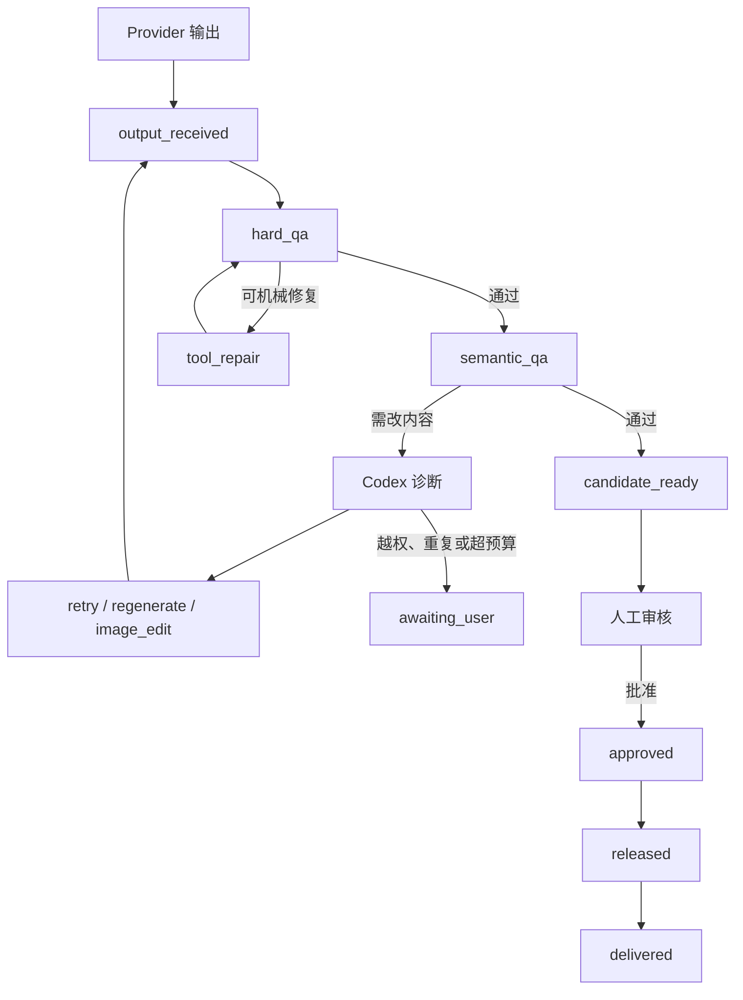

# Codex 监督式智能生产

> 文档状态：M2 确定性 Controller/Worker 与 M4 Codex Supervisor 已实现；M5 真实游戏试点仍待开始
> 设计输入：Codex 会话 `019f6bee-1442-7331-a919-c585f462ffec` 及 GAMS 当前生产代码
> 本文同时标明当前确定性能力和 Agent 边界；Codex 仍通过可选、隔离的 stdio 适配器接入，未配置时自动人工降级。

## 当前实现边界（2026-07-31）

M2.1 已实现生成计划显式确认、任务级冻结供应商/模型、跨供应商 DAG 真实数据流、计划/供应商独立并发、lease/heartbeat、幂等 Attempt、预算、崩溃恢复、持久事件、Finding、Evidence、白名单 RemediationAction 和确定性媒体 Worker。Web 运行检查器允许人工查看证据并执行 `retry`、`tool_repair`、`regenerate`、`image_edit` 或 `await_user`，因此 Codex 不可用不会阻断确定性生产；模型不可用也不会自动切换路由。

M4 已实现 Codex 适配边界、AgentSession/AgentEvent、自动结构化诊断和审计 ChangeSet；适配器不可用时仍保持人工降级。M3 的 Manifest v2、外部 checkout Delivery 与 `gams-lock.json` 继续由确定性层管理。

## 结论

把图片 API 接入生成队列，不会自动得到 Codex 会话中的“智能生产”体验。图片供应商只负责返回输出；会话中表现出的检查、重试、调整脚本、观察联系表、更新台账和验证游戏构建，来自 Codex 在供应商外部充当生产主管。

GAMS 采用双层模型；其中确定性层已在 M2 落地，智能监督层留在 M4：

- 确定性 GAMS 核心拥有状态、预算、文件事务、QA、审核、Release 和 Delivery。
- Codex 监督 Agent 观察结构化证据，诊断问题并选择一个受控修复动作。

Codex 只提出结构化动作。GAMS Controller 校验权限、预算、当前状态和输入哈希后才执行动作。Agent 不能直接宣布资产通过、改写审核或生成 Release。

## 从既有生产会话提炼的经验

会话 `019f6bee-1442-7331-a919-c585f462ffec` 体现的可复用能力不是某个单一 Prompt，而是一套循环：

1. 读取资产台账、Prompt、参考图、输出文件和前次失败记录。
2. 区分网络、鉴权、额度、内容策略、媒体格式、Alpha、构图、人物身份和风格问题。
3. 生成联系表、叠加图、差异图或边缘证据，而不是逐张凭印象判断。
4. 优先使用确定性工具修复可机械解决的问题；只有语义或视觉内容错误才再次调用付费模型。
5. 变更 Prompt、蒙版、阈值或脚本后重新运行 QA、测试与构建。
6. 更新生产记录，保留失败原因、采用的策略和结果。
7. 无法安全继续、重复失败或成本触顶时停止并请求人工判断。

GAMS 的目标是把这套循环变成可审计产品能力，而不是让 Agent 任意操作仓库。

## 四个执行角色

| 角色 | 负责 | 不负责 |
|---|---|---|
| GAMS Controller | 状态机、计划确认、预算、Job lease、动作校验、文件事务、审核与交付 | 不做开放式视觉推理，不让模型直接写事实源 |
| 媒体工具 Worker | 解码、尺寸、编码、色键、抠图、边缘清理、联系表、叠加和差异图 | 不决定人物是否正确，不批准资产 |
| Codex Supervisor | 阅读证据、分类问题、解释原因、选择下一动作、提出 Project 配置或 ChangeSet | 不持有供应商凭据，不直接写 SQLite、审核、Release 或 Git |
| 人工制作人 | 批准候选、调整预算、处理账号/额度、批准 ChangeSet、决定 Git 操作 | 不需要手工重复确定性检查 |

当 Codex 不可用时，Controller 和 Worker 必须继续工作；系统降级为人工查看 Finding 并选择动作，而不是让整个队列失效。

## 生产状态机与里程碑边界

主状态严格按以下顺序推进：

`output_received → hard_qa → semantic_qa → candidate_ready → approved → released → delivered`

状态含义：

| 状态 | 唯一含义 | 进入条件 |
|---|---|---|
| `output_received` | 供应商返回了可记录的输出 | 响应已落为不可变原始 Artifact；尚未证明图片可用 |
| `hard_qa` | 正在或已经执行确定性检查 | 输入 Artifact 哈希固定，检查结果已写入 Finding |
| `semantic_qa` | 语义检查边界；确定性证据可人工检查，M4 可请求隔离 Agent 自动诊断 | 硬 QA 不含阻塞 Finding，视觉证据包已生成 |
| `candidate_ready` | 候选满足自动检查，可供人工审核 | 所有阻塞 Finding 已解决，预算与证据完整 |
| `approved` | 人工批准了精确修订和媒体 Blob | 审核绑定修订、依赖哈希和 Artifact 哈希 |
| `released` | 当前为不可变 Release v1；M3 升级到 Manifest v2 | 当前 v1 或未来 v2 全量预检通过 |
| `delivered` | M3 已实现：Release 已应用到游戏 checkout 并通过验证 | `gams-lock.json` 和 Delivery 收据已写入 |

`remediating`、`awaiting_user`、`cancelled` 和 `failed` 是控制状态，不得伪装成上述成功阶段。



## 依赖批次与证据包

Controller 按 DAG 形成最多 6 项的依赖批次。批次上限用于控制上下文体积、联系表可读性和问题隔离，不等于供应商并发上限。

每批完成输出后自动生成：

- 深色、浅色和棋盘格三种联系表。
- 参考图与候选的并排图。
- 参考图与候选的 50% 叠加图。
- 像素或感知差异图；不适用时记录原因。
- 硬 QA 报告及全部结构化 Finding。
- 供应商请求 ID、模型快照、Prompt/参考输入哈希和 Artifact 血缘。
- 当前记录人工或 Agent 所选动作、预计额外调用数、理由、置信度与输入哈希。

证据必须存入 Project 的不可变历史或可提升 Artifact；联系表等可重建缓存可以放在 workspace。正式 Finding 不能只存在于 Codex 对话文本中。

## QA 分层

### 硬 QA

硬 QA 由确定性代码执行，至少覆盖：

- 文件存在、可解码、MIME 与编码匹配。
- 宽高、比例、字节大小和颜色模式。
- 需要透明时存在 Alpha、透明角和合理主体覆盖率。
- 绿幕/品红幕残留、明显空图或全透明图。
- 内容哈希与声明一致，目标路径合法且位于 Project 内。

当前 Worker 已有 Pillow 归一化、尺寸/编码处理、角点色键、智能抠图适配和边缘清理；所有 Worker 输出都会创建新修订并重新执行硬 QA。服装误删、人物身份和更高层视觉语义仍不能由这些确定性工具可靠判断。

### 语义与视觉 QA

语义 QA 处理确定性规则无法可靠判断的内容：

- 人物身份、年龄、服装、配色和表情是否符合资产定义。
- 构图、姿态、视线、主体占比和裁切是否符合用途。
- 背景、CG 与剧情场景是否一致。
- 图标是否可读，是否出现错误文字、伪文字或多余标志。
- 同一批次内风格、光照、材质和轮廓是否漂移。
- 编辑任务是否保留未要求改变的身份特征和服装区域。

Codex 使用联系表与差异证据输出 Finding；低置信度结果可以标记为非阻塞并交给人工，不得通过夸大置信度绕过审核。

## 结构化领域对象

### Artifact

每次供应商输出和工具修复都生成新的 Artifact，不覆盖父产物。

```json
{
  "id": "artifact_...",
  "kind": "provider_output | normalized_image | matte | contact_sheet | diff_image",
  "sha256": "...",
  "path": "workspace/... 或耐久对象路径",
  "parent_artifact_ids": ["artifact_..."],
  "producer": {
    "kind": "provider | worker",
    "name": "...",
    "version": "..."
  },
  "created_at": "..."
}
```

### Finding

```json
{
  "id": "finding_...",
  "code": "alpha.background_residue",
  "severity": "info | warning | error",
  "blocking": true,
  "evidence": [
    {"artifact_id": "artifact_...", "region": [0, 0, 128, 128], "note": "右上角残留绿边"}
  ],
  "confidence": 0.96,
  "suggested_action": "tool_repair"
}
```

Finding code 使用稳定命名空间；自然语言解释可以变化，但 Controller 的停止条件只按稳定 code 和阻塞属性计数。

### RemediationAction

当前人工检查器和未来 Agent 都只能提交 Controller 白名单动作：

- `retry`：同一请求因网络、5xx、限流或空响应重试。
- `tool_repair`：使用已注册 Worker 和显式参数产生新 Artifact。
- `regenerate`：调整 Prompt/参考后重新生成完整输出。
- `image_edit`：保留原图并执行局部或参考图编辑。
- `await_user`：停止当前范围并说明所需人工决定。
- `propose_changeset`：为超出 Project 白名单的代码或文档变更生成补丁提案；只写入隔离补丁区并等待人工审批，不直接应用。

示例输出：

```json
{
  "schema_version": 1,
  "finding_ids": ["finding_123"],
  "action": "tool_repair",
  "parameters": {
    "worker": "background_remove",
    "strategy": "semantic_matte_then_edge_cleanup"
  },
  "expected_additional_calls": 0,
  "reason": "主体身份与构图正确，仅背景残留可由确定性后处理解决",
  "confidence": 0.93
}
```

未知字段可以保留用于审计，未知动作必须拒绝。执行前 Controller 重新校验输入 Artifact 哈希、当前 Job 状态、预算和 Worker 参数 Schema，防止对过期候选执行动作。

### AgentSession

AgentSession 至少记录：

- Codex thread ID 和每次 turn ID。
- 使用的适配器、SDK/CLI 版本及结构化输出 Schema 版本。
- Project、计划、批次和资产范围。
- 只读输入 Artifact 与上下文包哈希。
- 沙箱、允许动作和可写白名单。
- Finding、Action、Controller 接受/拒绝原因和预算变化。
- Agent 不可用、超时、中断和人工续接事件。

## 问题分类与处理矩阵

| 问题 | 默认动作 | 自动边界 | 停止条件 |
|---|---|---|---|
| 网络中断、5xx、限流、空响应 | `retry`，指数退避并加入 jitter | 同一请求最多 2 次网络重试 | 重试耗尽进入 `awaiting_user` 或失败 |
| 鉴权、套餐、额度、计费 | 暂停相关供应商队列 | 不自动换账号、Key 或供应商 | 用户处理并重新解锁/确认 |
| 内容安全策略 | `await_user`，提供合规改写建议 | 不规避策略，不自动削弱安全约束 | 用户确认新 Prompt 后形成新请求 |
| 尺寸、编码、文件体积 | `tool_repair` | 只用注册 Worker，修复后重跑硬 QA | 同一 Finding 第三次出现 |
| Alpha 或背景问题 | 色键 → 语义抠图 → 边缘清理 → QA | 先零付费工具修复，仍失败才考虑生成 | 策略耗尽、误删主体或预算触顶 |
| 人物身份、服装、构图、错误文字、风格漂移 | `regenerate` 或 `image_edit` | Codex 必须引用视觉证据并说明改变范围 | 单资产额外付费返工达到 2 轮 |
| 未知供应商/工具错误 | `await_user` | 不盲目无限重试 | 首次无法分类即人工接管 |
| 游戏构建或 E2E 失败 | 先分类资源、导出或消费端代码问题 | 禁止一律重新生图 | 需要代码改动时提出 ChangeSet |

## 预算与循环停止

计划确认时必须展示：

- `base_calls`：计划本身需要的基础供应商调用量。
- `estimated_base_cost`：供应商有可用价格时的基础成本。
- `suggested_extra_calls = max(2, ceil(base_calls × 20%))`。
- 用户确认的 `extra_call_budget`；用户可以下调建议值。
- 单资产 `max_paid_remediation_rounds = 2`。
- 同请求 `max_transport_retries = 2`。

额外调用预算和单资产轮次是两个独立硬上限，达到任一上限即进入 `awaiting_user`。网络重试不占“付费返工轮次”，但所有实际供应商请求仍记录尝试、请求 ID 和可能成本，不能从审计或费用统计中隐藏。

重复 Finding 的停止规则：

1. 第一次出现：按优先策略修复。
2. 同一阻塞 code 在下一候选再次出现：必须更换策略，不能原样重复。
3. 第三次出现：停止自动循环并进入 `awaiting_user`。

“更换策略”指改变动作类型、Worker 或生成约束；只改措辞但保持相同输入与参数不算更换。

## Codex 集成方式

制作台通过一个隔离适配层调用官方 Python SDK 或本机 App Server。当前实现提供固定的本地 stdio JSON 通道；适配器在本机控制线程/turn，制作台把 Agent 事件转发为 GAMS 事件，但不让 Codex 成为事实源。

截至本文基线，官方文档将 Python SDK 标为 beta，App Server 的部分接口和 WebSocket transport 标为实验性能力。因此实现必须：

- 固定 SDK 与其自带运行时版本，不依赖用户 PATH 中偶然安装的 CLI。
- 优先使用 SDK 管理的本机 stdio/JSON-RPC 通道；不向网络暴露 App Server。
- 通过 `CodexAdapter` 隔离 SDK 类型、事件和实验字段。
- 保存协议/Schema 版本，并对未知事件向前兼容、对未知动作 fail closed。
- Codex 不可用或适配失败时降级到人工模式。

选择这条路径的依据是官方已提供的线程 start/resume、turn 事件流、沙箱控制和 SDK 集成能力；它不代表 GAMS 可以绕过自身 Controller。参考：

- [Codex App Server](https://learn.chatgpt.com/docs/app-server.md)
- [Codex SDK](https://learn.chatgpt.com/docs/codex-sdk.md)
- [Codex 沙箱与审批](https://learn.chatgpt.com/docs/agent-approvals-security.md)

## 权限与变更边界

### 可自动执行

在用户确认的 Project 与计划范围内，Controller 可以接受 Agent 对以下白名单对象的修改：

- Prompt 配方和负面约束。
- 生成尺寸、质量、参考图选择和供应商参数。
- 后处理策略、Worker 参数和 QA 阈值配置。
- Agent 管理、可重建的生产记录与诊断文档。

这些修改仍以新修订或事件记录写入，不覆盖历史，并且必须带输入哈希和理由。

### 必须人工批准 ChangeSet

- GAMS 源代码、测试、依赖或配置。
- 游戏仓库源代码、构建配置或测试。
- 仓库中的手写产品、架构、运营和发布文档。
- 超出白名单的任意脚本或可执行命令。

ChangeSet 在隔离 worktree 或补丁区生成，展示目标仓库、基线提交、文件 diff、验证命令和风险。未经批准，不应用到主工作区。

### 永远禁止 Agent 直接修改

- SQLite 或任何任务/审核数据库行。
- 人工审核决定与批准指针。
- 已批准内容寻址对象。
- Release Manifest 和 Delivery 收据。
- `gams-lock.json`。
- 供应商 API Key、Codex 登录凭据或其他密钥。
- Git index、commit、push、分支历史或远端状态。

Codex 登录与图片供应商凭据完全分离。上下文包只提供脱敏后的供应商类型、模型、请求 ID、错误分类和成本，不提供 API Key。

## 事件流

GAMS 对 UI 提供自己的稳定持久事件，而不是直接暴露供应商或未来 SDK 私有事件。M2 当前事件包括：

- `plan.confirmed`、`run.queued`、`run.lease_acquired`、`run.inputs_resolved`
- `run.stage_changed`
- `artifact.created`
- `finding.created`
- `provider.call_started`、`provider.call_failed`、`provider.credentials_locked`
- `worker.started`、`action.accepted`
- `budget.changed`
- `run.awaiting_user`、`run.recovered`、`run.resumed`

M4 增加 `agent.turn_started`、`agent.diagnosis_ready`、`agent.unavailable`、`agent.config_applied`、`action.proposed/rejected` 和 `changeset.*`；事件由 GAMS 持久化并可从 `history/agent` 重建。

每个事件带 Project、plan、job、asset、attempt、时间戳和因果事件 ID。UI 断线后通过持久事件游标续接；Codex 的文本增量只用于展示，最终状态以 Controller 事件为准。

## 降级与人工接管

以下情况必须进入人工模式：

- Codex SDK/App Server 不可用、认证失效或协议不兼容。
- Agent 输出不符合 Schema，或连续两次无法修复输出格式。
- 建议动作越权、目标 Artifact 已变化或 Worker 不存在。
- 预算触顶、同一阻塞 Finding 第三次出现或置信度不足。
- 需要修改代码、手写文档或扩大 checkout 写入范围。
- 问题属于供应商账号、内容策略或未知计费风险。

人工接管页面必须保留完整证据、可选动作、成本影响和停止理由。用户可以批准某个动作、调整预算、替换 Prompt、驳回候选或结束计划，但不能通过 UI 把 QA fail 直接改成 pass。

## 测试与验收

M2 当前已覆盖：

- QA fail 后进入诊断/返工，而不是 `succeeded` 或 `candidate_ready`。
- 网络重试最多 2 次，鉴权/额度锁定整个相关队列，内容策略不自动规避。
- 色键、智能抠图适配、边缘清理、尺寸/编码修复与复验。
- 同一 Finding 第二次切换策略、第三次停止。
- 计划总额外调用、单资产付费返工和实际费用记录。
- Codex 不可用时的人工降级，不丢失 Job 或 Finding。
- 并发与 DAG 真实产物注入、崩溃恢复、未知交付、未知动作/Worker 拒绝、过期输入拒绝、证据哈希和旧 SQLite 兼容升级。

M4 已覆盖 Agent JSON Schema、语义 Finding、ChangeSet 路径白名单和 Agent 不执行 Git 操作；M5 继续覆盖真实游戏 checkout 的构建与 E2E 验收。
