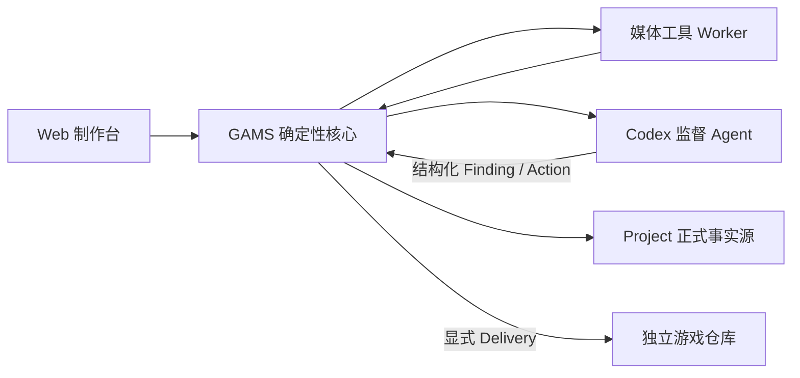

# 架构说明

> 阅读约定：未特别标注的内容描述截至 2026-07-31 的当前实现；“目标”内容描述 M6 及之后尚未实现的方向。两者不能混用。

## 单一 Project 契约

Project 根目录的 `project.yaml` 是识别入口，当前且唯一的 `format_version` 为 `1`。系统不会猜测目录类型，也不会打开其他存储布局。

```text
catalog/       可变的当前资产描述，按内容领域和媒体类别分组
history/       内容寻址的不可变修订、Artifact 元数据、QA 与审核记录
production/    风格圣经、Prompt 配方、制作母版和内容寻址原始来源
approved/      内容寻址的已批准运行媒体
releases/      不可变发布 Manifest
workspace/     候选、驳回、QA 报告、缓存和日志
```

磁盘文件统一使用 `snake_case`。资产类别固定为 `content`、`design`、`entity`、`media` 和 `production`，不使用路径类别别名。

## 当前数据流

1. Catalog 描述稳定 Key、类型、关系和当前/候选修订指针。
2. 新修订以规范 JSON 哈希写入 `history/objects/<prefix>/<hash>.json`；媒体 rendition 内嵌在媒体修订中。
3. 用户在 Web 中为每项任务选择供应商和模型，并冻结生成 DAG、Prompt、尺寸、Schema、参考输入、并发和预算后显式确认。Controller 同时实施计划总并发与各供应商独立并发，lease、heartbeat、Attempt、冻结供应商快照和事件写入 SQLite。
4. 供应商输出先写入 `workspace/candidates` 并进入 `output_received`；DAG 下游接收上游修订、内容哈希与真实产物。重启只恢复已落盘输出、确定性 Worker 或已知可重试错误，未知交付进入 `awaiting_user`。
5. 图片归一化后执行硬 QA，生成 Finding、联系表和对比证据。QA fail 进入 `awaiting_user`；人工可选择注册 Worker、重试、重新生成或图像编辑，所有动作校验输入哈希和预算后才入队。
6. 人工批准媒体时，把原始来源提升到 `production/sources/<hash>`、运行媒体提升到 `approved/objects/<hash>`，写入 Artifact 元数据和只引用耐久对象的 promotion 修订，最后更新 Catalog 指针。
7. 审核记录绑定准确修订、依赖哈希以及来源/运行 Artifact 哈希。文件事务失败时恢复 Catalog 和本次正式记录；正确但孤立的内容寻址 Blob 可由后续垃圾回收处理。
8. Release v1 对全部已批准资产执行 fail-closed 预检，Release v2 还可以接受显式稳定 Key 子集；成功后写不可变 Manifest。`target_path` 仅作为后续 Delivery 的逻辑目标，Release 不再从 workspace 发布媒体。
9. M5 旧媒体升级是显式 API 操作：它把 legacy `approved/assets/**` 输入复制为内容寻址 Artifact，创建 Promotion Revision 和依赖哈希 Review；扫描不会隐式改写历史。试点脚本随后写入可重建的 Plan/Job/Attempt/Finding/Action/Evidence 链，并把媒体基线 Delivery 到独立游戏 checkout。

SQLite 是可重建索引。项目扫描会按磁盘权威状态重建资产、修订、Artifact、rendition、QA、审核、关系和 Release；任务队列等本地运行状态继续保存在 SQLite。

## 多供应商与模型路由

供应商配置属于本机运行层，不进入 Project。每个活动配置独立保存 OpenAI 兼容 Base URL、默认文字/图片模型、模型缓存、并发、重试和价格；API Key 例外，只以浏览器 IndexedDB 加密记录和后端进程内明文存在。

全局文字与图片默认路由只在建立新任务时读取。文字任务使用文字路由，图片生成和图片编辑使用图片路由；草稿建立后，默认值变化不会改写已有任务。任务可覆盖供应商和模型，未分类或手填模型会警告，明确不兼容的模型会阻止确认。

计划确认时，每个 Job 保存供应商 ID、显式模型和不含凭据的运行快照，包括 Base URL、质量、并发、重试与价格。Runner 始终使用该快照和模型；后续编辑或归档供应商不会改写已确认 Job。凭据锁定只暂停对应供应商任务，跨供应商下游继续等待上游；模型不可用写入 `provider.model_unavailable` 并等待人工，不执行模型替换、负载均衡或故障转移。

## 四层架构与实现边界

生产系统采用“确定性核心 + 受限智能监督”的分层边界。M2–M4 已实现 Controller、媒体 Worker、Codex Supervisor；M3 的外部游戏交付也已接通：



| 层 | 状态 | 职责与硬边界 |
|---|---|---|
| GAMS 确定性核心 | M2–M3 已实现 | Controller、Project/SQLite 同步、计划、DAG、预算、任务租约、文件事务、硬 QA、审核、Release 与 Delivery；唯一能改变生产状态，任何动作先校验 Schema、状态、输入哈希和预算。 |
| 媒体工具 Worker | M2 已实现 | 编解码、尺寸、色键/智能抠图适配、边缘清理、联系表、叠加和差异图；不能批准资产或修改 Catalog 指针。 |
| Codex 监督 Agent | M4 已实现 | 通过隔离 stdio 适配器读取脱敏证据，执行结构化语义/视觉诊断、选择受控修复策略或提出 ChangeSet；只能返回结构化动作。 |
| 游戏仓库 | M3 已实现 | 消费确定性内容模块、资产 Manifest、运行媒体和 `gams-lock.json`；只通过显式导出改变。 |

Web 制作台是 Controller 的客户端，不另建业务事实源。Codex 目标集成使用官方 Python SDK 控制本机 App Server，但 SDK/协议由适配层隔离；其 beta/实验性生命周期不能传播为 Project 契约。

### 当前生产边界

- Provider 输出先以哈希落盘并记录 `artifact.created` 事件，只能进入 `output_received`，不能直接成为成功或批准状态；人工批准时才提升为正式耐久 Artifact。
- 硬 QA、候选就绪、人工批准、Release 和 Delivery 是互不替代的阶段；M2 的 `candidate_ready` 只表示确定性自动检查已通过，仍需人工审核。
- Controller 只执行白名单 `RemediationAction`，并拒绝过期输入、未知 Worker、超预算和第三次重复 Finding。
- Codex 不可用时，Controller、Worker 和人工运行检查器仍可完成确定性循环。

### 后续目标边界

- M4 Agent 只允许提出 Project 白名单内的 Prompt、参数、后处理配置或待批准 ChangeSet；供应商 API Key 不进入 Agent 上下文。
- GAMS 代码、游戏代码和手写文档变更只生成待批准 ChangeSet。
- M3 Delivery 使用 Manifest v2、checkout staging、受管文件哈希、验证命令和不可变收据。

目标生产循环详见 [Codex 监督式智能生产](agentic-production.md)，候选提升、Release v2 和游戏 checkout 事务详见 [Release 与游戏项目交付](release-delivery.md)；M5 的重放步骤和已知游戏侧验收阻塞见 [M5 Emperor-Simulator 试点](m5-pilot.md)。

## 本机状态

- Project 容器默认位于 `~/Library/Mobile Documents/com~apple~CloudDocs/Game-Projects`。
- SQLite、WAL 和运行状态位于本机 `~/Library/Application Support/Game-Asset-Management-System`，不由 iCloud 或 Git 同步。
- `project.local.yaml` 保存本机游戏 checkout 绑定并被 Git 忽略。
- 供应商配置、模型缓存、全局默认路由和冻结 Job 快照位于本机 SQLite；删除数据库会丢失这些本机设置与未完成运行，但不会丢失 Project 正式事实。
- 浏览器 IndexedDB 按供应商 ID 保存加密 API Key；Web 连接本地后端后逐个解锁活动供应商，单个失败不会阻止其他供应商。
- `Game-Projects` 是统一父 Git 仓库；Project 不创建嵌套仓库，媒体使用普通 Git。
- iCloud 不提供跨机器写锁；同一 Project 不能由多台机器同时写入，并应在使用前保持完整下载。

## 安全

- 所有相对路径必须通过项目根目录逃逸检查。
- 修订、审核和 Release 记录不可变。
- 写入使用 Project 锁和原子替换。
- API 只绑定回环地址；API Key 明文不写 Project、SQLite、Job 快照、事件或日志，浏览器磁盘上只保存加密凭据。
- GAMS 与 Codex 都不执行 `git add`、commit、push 或历史改写。
