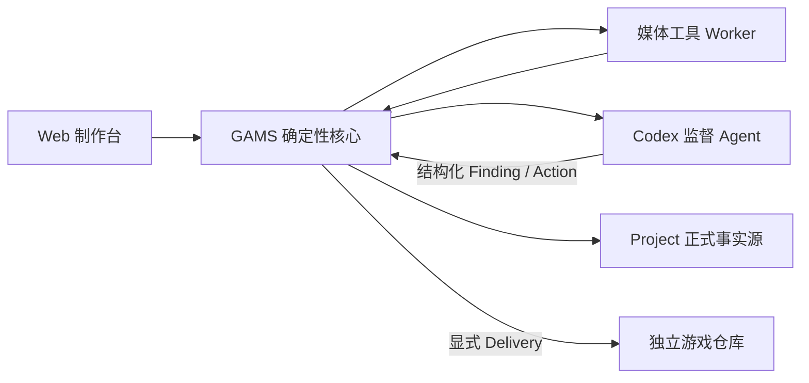

# 架构说明

> 阅读约定：未特别标注的内容描述截至 2026-07-27 的当前实现；“目标架构”章节描述已确认但尚未实现的 v1 方向。两者不能混用。

## 单一 Project 契约

Project 根目录的 `project.yaml` 是识别入口，当前且唯一的 `format_version` 为 `1`。系统不会猜测目录类型，也不会打开其他存储布局。

```text
catalog/       可变的当前资产描述，按内容领域和媒体类别分组
history/       内容寻址的不可变修订与审核记录
production/    风格圣经、Prompt 配方和制作母版
approved/      已批准的精确媒体字节
releases/      不可变发布 Manifest
workspace/     候选、驳回、QA 报告、缓存和日志
```

磁盘文件统一使用 `snake_case`。资产类别固定为 `content`、`design`、`entity`、`media` 和 `production`，不使用路径类别别名。

## 当前数据流

1. Catalog 描述稳定 Key、类型、关系和当前/候选修订指针。
2. 新修订以规范 JSON 哈希写入 `history/objects/<prefix>/<hash>.json`；媒体 rendition 内嵌在媒体修订中。
3. 媒体生成先写入 `workspace/candidates`，归一化并完成硬 QA。
4. 人工审核把准确修订设为当前版本，审核记录写入 `history/reviews`。
5. Release 尝试收集有效批准修订，并将批准媒体原子发布到 Project 内目标路径；当前实现会跳过不合格资产，尚未达到目标的 fail-closed 语义。

SQLite 是可重建索引。项目扫描会按磁盘权威状态重建资产、修订、rendition、QA 和关系；任务队列等本地运行状态继续保存在 SQLite。

## 目标四层架构

目标生产系统采用“确定性核心 + 受限智能监督”的分层边界：



| 层 | 目标职责 | 硬边界 |
|---|---|---|
| GAMS 确定性核心 | Controller、Project/SQLite 同步、计划、DAG、预算、任务租约、文件事务、硬 QA、审核、Release 和 Delivery | 唯一能改变生产状态的组件；任何动作先校验 Schema、权限、哈希和预算 |
| 媒体工具 Worker | 编解码、尺寸、色键/语义抠图、边缘清理、联系表、叠加和差异图 | 输入输出都是 Artifact；不能批准资产或修改 Catalog 指针 |
| Codex 监督 Agent | 读取证据、语义/视觉诊断、选择受控修复策略、提出 ChangeSet | 只返回结构化动作；不能直接写 SQLite、审核、批准对象、Release、Delivery 或 Git |
| 游戏仓库 | 消费确定性内容模块、资产 Manifest、运行媒体和 `gams-lock.json` | 不依赖 GAMS 进程或 Project 才能构建和运行；只通过显式导出改变 |

Web 制作台是 Controller 的客户端，不另建业务事实源。Codex 目标集成使用官方 Python SDK 控制本机 App Server，但 SDK/协议由适配层隔离；其 beta/实验性生命周期不能传播为 Project 契约。

### 目标生产边界

- Provider 输出先成为 `Artifact`，只能进入 `output_received`，不能直接成为成功或批准状态。
- 确定性硬 QA、语义 QA、候选就绪、人工批准、Release 和 Delivery 是互不替代的阶段。
- Agent 允许自动调整 Project 白名单内的 Prompt、参数、后处理配置和 Agent 管理的生产记录。
- GAMS 代码、游戏代码和手写文档变更只生成待批准 ChangeSet。
- Codex 登录与图片供应商凭据分离，供应商 API Key 不进入 Agent 上下文。
- Codex 不可用时，Controller 和 Worker 继续运行并降级为人工诊断。

目标生产循环详见 [Codex 监督式智能生产](agentic-production.md)，候选提升、Release v2 和游戏 checkout 事务详见 [Release 与游戏项目交付](release-delivery.md)。

## 本机状态

- Project 容器默认位于 `~/Library/Mobile Documents/com~apple~CloudDocs/Game-Projects`。
- SQLite、WAL 和运行状态位于本机 `~/Library/Application Support/Game-Asset-Management-System`，不由 iCloud 或 Git 同步。
- `project.local.yaml` 保存本机游戏 checkout 绑定并被 Git 忽略。
- `Game-Projects` 是统一父 Git 仓库；Project 不创建嵌套仓库，媒体使用普通 Git。
- iCloud 不提供跨机器写锁；同一 Project 不能由多台机器同时写入，并应在使用前保持完整下载。

## 安全

- 所有相对路径必须通过项目根目录逃逸检查。
- 修订、审核和 Release 记录不可变。
- 写入使用 Project 锁和原子替换。
- API 只绑定回环地址；凭据不写磁盘、数据库或日志。
- GAMS 与 Codex 都不执行 `git add`、commit、push 或历史改写。
