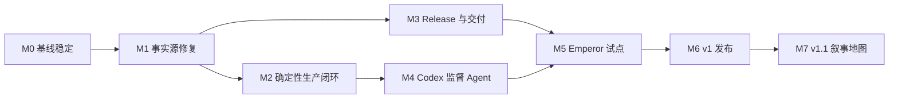

# GAMS 路线图

> 文档状态：已确认的目标计划
> 基线日期：2026-07-27
> 本文同时记录“当前能力”和“目标能力”。凡标记为“目标”或列入 M1 及以后里程碑的内容，均不得理解为已经实现。

## 产品方向

GAMS 的 v1 目标不是单纯调用图片供应商，而是建立一条可恢复、可审计、受预算约束的游戏资产生产与交付链路：

- GAMS 确定性核心负责 Project 事实源、任务状态、预算、文件事务、硬 QA、审核、Release 和 Delivery。
- Codex 监督 Agent 负责读取证据、诊断语义或视觉问题并选择修复策略。
- 媒体工具 Worker 负责抠图、尺寸调整、编码、边缘清理、联系表和差异图等确定性或模型化处理。
- 人工负责批准资产、扩大预算、批准代码 ChangeSet，以及决定 Git 提交和推送。

图片 API 返回结果只代表收到输出，不代表生产成功；只有完成 QA、审核、Release 和游戏仓库验收后，资产才完成交付。

## 当前基线

当前系统处于“v1 核心数据链路已存在，生产与交付闭环尚未完成”的阶段。下面是截至基线日期从代码和验收记录确认的状态。

| 能力 | 当前状态 | 说明 |
|---|---|---|
| 单一 Project 契约 | 已实现 | `project.yaml`、Catalog、不可变修订、审核、批准媒体和 Release 采用统一目录结构。 |
| Project 发现与扫描 | 已实现 | Project 文件是事实源，SQLite 保存可重建索引和任务状态。 |
| 资产、关系与修订 API | 已实现 | 支持稳定 Key、类型化关系、候选修订、批准指针和依赖失效。 |
| 供应商与凭据 | 已实现 | OpenAI 兼容供应商、离线假供应商、浏览器加密缓存和后端内存解锁已经存在。 |
| 生成后端 | 部分实现 | 已有计划校验、DAG 门控、持久 Job、重试、取消、恢复和事件流；Runner 仍逐项串行执行。 |
| 生成计划工作台 | 未实现 | Web 尚无计划编辑、成本确认、依赖配置和完整任务管理入口。 |
| 图片归一化与硬 QA | 部分实现 | 已有尺寸、编码、Alpha、体积和简单色键抠图；没有语义 QA、智能抠图 Worker 或自动返工。 |
| 人工审核 | 已实现 | 候选与批准版本分离，硬 QA 不通过时拒绝批准。 |
| Release | 部分实现 | 可生成 Project 内 Manifest 并发布媒体；当前会跳过不合格资产，尚非 fail-closed。 |
| 游戏仓库交付 | 未实现 | `project.local.yaml` 已预留 checkout 绑定，但没有 preview/apply/verify/rollback。 |
| Codex 监督 Agent | 未实现 | 当前没有内嵌会话、结构化 Finding/Action、诊断循环或 ChangeSet 审批。 |
| 叙事地图 | 未开始 | 类型化关系模型已具备，UI 安排在 v1.1。 |

历史验收快照记录了前端 25 项测试、API 23 项测试和 Emperor Project 扫描通过；这些数字属于 [设计 QA 基线](../design-qa.md)，不是持续监控结果。当前 M0 验收结果见下方带日期的记录。

## 已知缺口与 P0 风险

### P0-1：批准媒体仍可能依赖 workspace

当前生成修订中的 `source_path` 和 `normalized_path` 指向 `workspace/candidates`。批准只移动审核指针；正式媒体通常要到 Release 才复制到 `target_path`。删除 workspace 后，已批准修订可能无法预览、复验或重新发布。

目标是批准时就把原始输出和归一化媒体提升到 Git 跟踪、内容寻址的 `production/sources` 与 `approved/objects`。任何正式修订、审核决定和 Release 都不得引用 workspace。

### P0-2：Job 成功语义早于 QA 结果

当前 Runner 在创建候选并执行硬 QA 后，把 Job 标记为 `succeeded`，但没有根据 QA verdict 改变结果。于是“供应商调用成功”和“候选通过 QA”被混为一个状态。

目标状态必须严格区分：

`output_received → hard_qa → semantic_qa → candidate_ready → approved → released → delivered`

硬 QA 或语义 QA 失败必须进入诊断、返工或 `awaiting_user`，不能标记为生产闭环成功。

### P0-3：Release 不是 fail-closed

当前 Release 会跳过批准失效、依赖哈希变化或 QA 不通过的资产，并继续写出部分 Manifest。这可能造成调用方误以为整批内容已经发布。

目标是 Release 创建前完成全量预检。缺少任一要求项、路径碰撞、Blob 缺失或哈希不符时，整次 Release 失败，不写部分 Manifest，也不改变资产发布状态。

### P0-4：Release 与交付无法只靠 Project 恢复

Manifest 已写入 Project，但 SQLite 中的 Release 记录尚无对应的完整重建流程；外部游戏 checkout 更没有交付收据和 lock 文件。删除 SQLite 后，历史文件仍在，但系统不能完整恢复 Release/Delivery 查询与验证能力。

目标是让 Release、Delivery 和受管文件哈希都由 Project 文件恢复，SQLite 只作为索引。

### P0-5：并发、租约与预算尚未形成硬约束

供应商配置已有 `concurrency`，但 Runner 当前一次只取一个 Job；任务没有 lease/heartbeat，DAG 只做执行门控，不传递上游结构化产物；重试次数来自供应商配置，尚未形成计划级额外调用预算。

目标是由 Controller 统一实施真实并发、依赖数据流、租约恢复、网络重试和额外付费返工上限。

## 路线依赖

M1 是 M2 和 M3 的共同前置条件：如果正式媒体仍依赖 workspace，任何返工、Release 或交付自动化都会建立在不可靠的事实源上。M4 必须建立在 M2 的确定性 Controller 之上，Codex 不直接承担队列、预算或文件事务。

## 实施里程碑

### M0：基线稳定

范围：

- 落地本路线图、智能生产和 Release/Delivery 契约文档。
- 整理当前未提交的统一 Project 架构迁移，确认旧 Emperor 适配器和 Demo 资源的删除范围。
- 固化当前 API、Project 格式和前端真实数据流的测试基线。
- 将历史验收记录标成带日期的快照，避免把旧结果当作实时状态。

完成标准：

- `npm run build` 通过。
- `npm test` 通过，基线至少保持前端 25 项、API 23 项测试。
- 文档中的内部链接有效，所有未来能力都有“目标/未实现”标记。
- 本里程碑的代码与文档变更范围经人工复核后再由用户决定是否提交；GAMS 和 Codex 都不自动执行 Git 操作。

#### M0 验收记录（2026-07-27）

状态：已完成。

- 前端生产构建通过；前端测试 27 项、API 测试 24 项全部通过。
- Python 源码编译检查通过；API 测试仅有 1 条 Starlette TestClient 兼容性弃用警告，不阻塞基线。
- 真实 `Emperor-Simulator` Project 发现和扫描通过：1,144 个资产、1,144 个修订、0 个扫描错误。
- 浏览器烟雾验证通过：真实资产分类和 186 项媒体资产可见，缩略图及 1920×1080 已批准版本可加载，控制台无 warning/error。
- 旧 `packages/emperor_adapter`、Web Demo 数据与 Demo 资源删除范围已复核，仓库内无残留引用。
- 生成计划、自动返工、Release fail-closed、Delivery 和打开文件夹等后续能力仍按 M1 及以后里程碑管理，不计入本次完成状态。

### M1：P0 事实源修复

范围：

- 引入 `Artifact`，记录原始输出、修复产物、父产物、内容哈希和工具版本。
- 审批前把候选提升到 `production/sources` 和 `approved/objects` 的内容寻址对象。
- 确保正式修订只引用耐久对象；候选仍留在 workspace，可随时删除。
- 修正 Job/资产生成状态，使 QA fail 不再表现为 `succeeded`。
- 把 Release 改为完整预检、全有或全无的 fail-closed 操作。
- 从 Project 文件重建 Release 索引。

完成标准：

- 删除 Project 的 `workspace` 后，已批准媒体仍可预览、复验、扫描和发布。
- 删除 SQLite 后重新扫描，资产、修订、审核和 Release 可恢复。
- 任一资产批准失效、QA fail、路径碰撞或 Blob 缺失时，Release 不产生部分 Manifest。
- 文件提升或 Release 中途失败时，Catalog 指针和正式对象保持原状。

### M2：确定性生产闭环

范围：

- 实现生成计划编辑器、校验、调用量/成本预估和显式确认。
- 实现供应商与计划级真实并发，DAG 上游输出注入下游请求。
- 为 Job 增加 lease、heartbeat、幂等 attempt 和崩溃恢复。
- 建立阶段事件流和 `run inspect|resume` 能力。
- 自动生成深色、浅色、棋盘格联系表，以及并排、叠加和差异图。
- 增加确定性 Python 媒体 Worker：编码、尺寸、色键、智能抠图适配、边缘清理与复验。
- 接通“需要重做”入口、策略记录和预算计数。

完成标准：

- QA fail 进入 remediation 或 `awaiting_user`，不会标记为候选就绪。
- 服务在任意执行阶段重启后，不重复计费调用，能够从 lease/attempt 恢复。
- 供应商并发、计划总调用量和单资产返工上限均有自动化测试。
- 依赖任务使用真实上游产物，不只是等待状态完成。
- Codex 不可用时，用户仍能在确定性工作台中检查证据并手工选择返工动作。

### M3：Release 与游戏交付

范围：

- 引入 Release Manifest v2、snapshot hash、目标逻辑路径和媒体 Blob 哈希。
- 实现 `export preview|apply|verify|rollback`，以及对应 Web API/UI。
- 使用目标 checkout 内的 staging、受管文件清单、篡改检测和失败恢复。
- 生成 `gams-lock.json` 与 Project 内不可变 Delivery 收据。
- 验证命令使用 argv 数组执行，不通过 shell 拼接。

完成标准：

- 同一 Release 重复交付幂等；目标未变化时为可证明的 no-op。
- 未知文件永不删除；受管文件被人工修改时阻止覆盖。
- 任一步骤失败都恢复上一交付，当前可运行版本不被破坏。
- 可以通过重新导出旧 Release 回滚，不改写历史 Release。
- 游戏仓库在 GAMS 停止运行、Project 不可访问时仍能独立安装、测试、构建和运行。

详细契约见 [Release 与游戏项目交付](release-delivery.md)。

### M4：Codex 监督 Agent

范围：

- 通过官方 Python SDK/本机 App Server 适配层内嵌 Codex 会话。
- 生成只读上下文包、联系表、差异图和结构化 Finding。
- 只接受固定 `RemediationAction`，由 Controller 校验并执行。
- 允许白名单内自动修改 Prompt、生产参数、后处理配置和 Agent 管理的生产文档。
- GAMS 代码、游戏代码和手写文档变更只能产生待批准 ChangeSet。
- 记录 `AgentSession`、线程 ID、事件、预算、诊断理由和执行结果。

完成标准：

- 可复现“发现问题 → 诊断 → 选择动作 → 换策略 → 复验”的完整循环。
- Agent 输出不符合 Schema、动作未知、预算耗尽或服务不可用时均 fail closed。
- Codex 无法直接修改 SQLite、审核决定、批准对象、Release Manifest 或 Git 历史。
- 同一阻塞 Finding 第二次出现时切换策略，第三次出现时停止并等待人工。

详细设计见 [Codex 监督式智能生产](agentic-production.md)。

### M5：Emperor-Simulator 试点

范围：

- 以当前标准契约重建 Emperor Project，并绑定独立游戏 checkout。
- 只选择一批可控的真实资产：绿衣透明立绘、同角色表情编辑、图标、背景和 CG。
- 为试点确认基础调用量、成本和额外返工额度。
- 完整跑通生成、修复、语义复核、人工批准、Release、交付和游戏验收。

完成标准：

- 试点中的每项资产都具有完整 Artifact、Finding、Action、Review、Release 和 Delivery 证据链。
- 游戏仓库的内容模块、资产 Manifest、内容寻址媒体和 `gams-lock.json` 一致。
- 在 Emperor checkout 中依次通过 `pnpm check`、`pnpm build` 和 `pnpm test:e2e`。
- GAMS 与 Codex 只展示两个仓库的 diff，不执行 add、commit 或 push。

### M6：v1 发布

范围：

- 迁移全部正式资产；当前基线包含 186 项媒体，实际范围以迁移前预检为准。
- 对至少一个真实供应商执行成功、限流、5xx、鉴权、额度、内容策略和坏响应验收。
- 完成性能、并发、崩溃、磁盘不足、SQLite 删除和交付中断演练。
- 补齐用户操作文档、故障手册和格式升级策略。

完成标准：

- 生产链路可恢复、可审计、受预算约束且能解释停止原因。
- Release 与 Delivery 可以从 Project 事实源恢复和复验。
- Emperor 全量版本可在独立 checkout 中通过类型检查、测试、构建和浏览器 smoke test。
- 所有 P0/P1 缺陷关闭或有用户明确接受的降级方案。

### M7：v1.1 叙事地图

范围：

- 在现有类型化关系模型上增加章节树、场景编辑、关系画布、覆盖率与缺失资产规划。
- 保持 v1 的 Project 事实源、Artifact、Review、Release 和 Delivery 契约不变。

完成标准：

- 叙事地图生成的生产计划使用同一 M2–M4 闭环。
- 不为 UI 功能引入第二套资产身份或发布语义。

## 目标公共能力

计划中的 CLI/API 名称用于稳定产品契约，当前尚未实现：

- `gams plan validate|confirm`
- `gams run inspect|resume`
- `gams release preflight|create`
- `gams export preview|apply|verify|rollback --json`
- Web API 提供对应预检、执行、事件流、ChangeSet 审批和 Delivery 历史。

核心领域对象将新增或扩展为：

- `Artifact`：原始输出、修复产物、哈希、工具版本和父产物。
- `Finding`：问题代码、严重级别、是否阻塞、证据、置信度和建议动作。
- `RemediationAction`：`retry`、`tool_repair`、`regenerate`、`image_edit`、`await_user` 或 `propose_changeset`。
- `AgentSession`：Codex 线程、权限、事件、诊断输出和预算使用。
- `Delivery`：Release、目标 checkout、导出文件哈希、验证结果和回滚信息。

## 全局验收原则

- 每个状态都有唯一含义；供应商返回、QA 通过、人工批准、Release 和 Delivery 不能互相代替。
- 所有付费调用、工具处理、Agent 判断和人工决定都有可追溯记录。
- Project 正式事实不依赖 workspace、SQLite、Codex 会话或外部供应商继续可用。
- 自动化只在白名单、沙箱和预算内行动；超界时停止并请求人工决定。
- 任何批量 Release 或 Delivery 都是全有或全无，不产生静默的部分成功。
- GAMS 和 Codex 永不自行执行 `git add`、commit、push 或历史改写。
