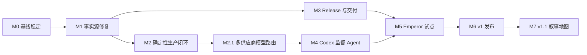

# GAMS 路线图

> 文档状态：已确认的目标计划
> 当前验收日期：2026-07-30
> 本文同时记录“当前能力”和“目标能力”。只有带“已完成”验收记录的里程碑属于当前能力；其余目标不得理解为已经实现。

## 产品方向

GAMS 的 v1 目标不是单纯调用图片供应商，而是建立一条可恢复、可审计、受预算约束的游戏资产生产与交付链路：

- GAMS 确定性核心负责 Project 事实源、任务状态、预算、文件事务、硬 QA、审核、Release 和 Delivery。
- Codex 监督 Agent 负责读取证据、诊断语义或视觉问题并选择修复策略。
- 媒体工具 Worker 负责抠图、尺寸调整、编码、边缘清理、联系表和差异图等确定性或模型化处理。
- 人工负责批准资产、扩大预算、批准代码 ChangeSet，以及决定 Git 提交和推送。

图片 API 返回结果只代表收到输出，不代表生产成功；只有完成 QA、审核、Release 和游戏仓库验收后，资产才完成交付。

## 当前基线

当前系统处于“M2.1 多供应商与任务级模型路由已完成，M3 外部交付与 M4 智能监督尚未完成”的阶段。下面是截至 2026-07-30 从代码和验收记录确认的状态。

| 能力 | 当前状态 | 说明 |
|---|---|---|
| 单一 Project 契约 | 已实现 | `project.yaml`、Catalog、不可变修订、审核、批准媒体和 Release 采用统一目录结构。 |
| Project 发现与扫描 | 已实现 | Project 文件是事实源；资产、修订、Artifact、审核、QA、关系和 Release 均可重建 SQLite 索引。 |
| 资产、关系与修订 API | 已实现 | 支持稳定 Key、类型化关系、候选修订、批准指针和依赖失效。 |
| 供应商与凭据 | 已实现 M2.1 | 支持多个 OpenAI 兼容供应商、软归档、模型缓存与人工分类、全局文字/图片默认路由、浏览器凭据隔离和逐供应商进程内解锁。 |
| 生成后端 | 已实现 M2.1 | 计划校验、任务级供应商/模型、冻结 Job 快照、跨供应商 DAG、计划总并发与供应商独立并发、lease/heartbeat、幂等 Attempt、预算、持久事件和 fail-closed 崩溃恢复均已接通。 |
| 生成计划工作台 | 已实现 M2.1 | Web 可编辑 Prompt、尺寸、Schema、依赖、参考任务、任务供应商与模型，按供应商展示成本并要求两步显式确认。 |
| 图片归一化与硬 QA | 已实现 M2 | 尺寸、编码、Alpha、体积、色键、智能抠图适配、边缘清理、联系表与差异证据已接通；Codex 自动语义诊断仍属于 M4。 |
| 人工审核 | 已实现 | 媒体批准会提升耐久 Artifact、创建 promotion 修订并绑定 Artifact/依赖哈希；硬 QA 不通过时拒绝批准。 |
| Release | 部分实现 | Release v1 已全量预检、fail-closed 且可重建索引；Manifest v2、snapshot hash 与 Delivery 尚未实现。 |
| 游戏仓库交付 | 未实现 | `project.local.yaml` 已预留 checkout 绑定，但没有 preview/apply/verify/rollback。 |
| Codex 监督 Agent | 未实现 | 确定性 Finding、Evidence、RemediationAction 和人工检查器已存在；内嵌会话、自动语义诊断、AgentSession 与 ChangeSet 仍属于 M4。 |
| 叙事地图 | 未开始 | 类型化关系模型已具备，UI 安排在 v1.1。 |

历史验收快照记录了前端 25 项测试、API 23 项测试和 Emperor Project 扫描通过；这些数字属于 [设计 QA 基线](../design-qa.md)，不是持续监控结果。当前 M0–M2.1 验收结果见下方带日期的记录。

## P0 风险状态

### P0-1（M1 已关闭）：批准媒体依赖 workspace

生成候选仍位于 `workspace/candidates`，但批准时会把原始来源和运行媒体提升到 `production/sources` 与 `approved/objects`，创建只引用耐久对象的 promotion 修订。扫描器拒绝把仍引用 workspace 的修订作为当前批准版本。

审核决定绑定准确修订、依赖哈希和来源/运行 Artifact 哈希；删除 workspace 后仍可预览、复验、扫描和 Release。

### P0-2（M2 已关闭）：Job 成功语义早于 QA 结果

Runner 会保留供应商 Attempt 的成功事实，但 Provider 输出只进入 `output_received`。硬 QA fail 会写入 Finding 和证据并进入 `awaiting_user`，不再表现为 `succeeded` 或 `candidate_ready`；通过后才进入可供人工审核的候选状态。

目标状态必须严格区分：

`output_received → hard_qa → semantic_qa → candidate_ready → approved → released → delivered`

硬 QA 或语义 QA 失败必须进入诊断、返工或 `awaiting_user`，不能标记为生产闭环成功。

### P0-3（M1 已关闭）：Release 部分成功

Release v1 现在先收集完整问题列表；批准失效、依赖变化、QA fail、路径碰撞、Blob 缺失、哈希或体积不符都会阻止整次 Release。

预检失败不写 Manifest、不改变资产发布状态；正式文件写入中途失败会恢复 Release 指针、Catalog 和本次 Manifest。

### P0-4（Release 部分已关闭）：Project 恢复边界

Artifact、真实审核决定和 Release 已能从 Project 文件重建 SQLite 索引。外部游戏 checkout 的 Delivery 收据、受管文件哈希和 lock 文件尚未实现，继续由 M3 负责。

M3 的目标仍是让 Delivery 和受管文件哈希同样由 Project 文件恢复，SQLite 只作为索引。

### P0-5（M2 已关闭）：并发、租约与预算形成硬约束

Controller 同时执行计划总并发和每个供应商的冻结并发上限，使用原子 claim、lease 和 heartbeat 管理真实并发；一个供应商的上限不会压缩其他供应商。DAG 下游请求包含上游修订、内容哈希与结构化产物；基础调用、实际调用/成本、网络重试、计划额外调用和单资产付费轮次分别计数并受硬上限约束。

## 路线依赖

M1 已满足 M2 和 M3 的共同事实源前置条件。M4 必须建立在 M2.1 的确定性 Controller 与冻结任务路由之上，Codex 不直接承担队列、预算、供应商故障转移或文件事务。

## 实施里程碑

### M0：基线稳定

范围：

- 落地本路线图、智能生产和 Release/Delivery 契约文档。
- 整理当前未提交的统一 Project 架构迁移，确认旧 Emperor 适配器和 Demo 资源的删除范围。
- 固化当前 API、Project 格式和前端真实数据流的测试基线。
- 将历史验收记录标成带日期的快照，避免把旧结果当作实时状态。

完成标准：

- `npm run build` 通过。
- `npm test` 通过，基线至少保持前端 25 项、API 23 项测试。
- 文档中的内部链接有效，所有未来能力都有“目标/未实现”标记。
- 本里程碑的代码与文档变更范围经人工复核后再由用户决定是否提交；GAMS 和 Codex 都不自动执行 Git 操作。

#### M0 验收记录（2026-07-27）

状态：已完成。

- 前端生产构建通过；前端测试 27 项、API 测试 24 项全部通过。
- Python 源码编译检查通过；API 测试仅有 1 条 Starlette TestClient 兼容性弃用警告，不阻塞基线。
- 真实 `Emperor-Simulator` Project 发现和扫描通过：1,144 个资产、1,144 个修订、0 个扫描错误。
- 浏览器烟雾验证通过：真实资产分类和 186 项媒体资产可见，缩略图及 1920×1080 已批准版本可加载，控制台无 warning/error。
- 旧 `packages/emperor_adapter`、Web Demo 数据与 Demo 资源删除范围已复核，仓库内无残留引用。
- 生成计划、自动返工、Release fail-closed、Delivery 和打开文件夹等后续能力仍按 M1 及以后里程碑管理，不计入本次完成状态。

### M1：P0 事实源修复

范围：

- 引入 `Artifact`，记录原始输出、修复产物、父产物、内容哈希和工具版本。
- 审批前把候选提升到 `production/sources` 和 `approved/objects` 的内容寻址对象。
- 确保正式修订只引用耐久对象；候选仍留在 workspace，可随时删除。
- 修正 Job/资产生成状态，使 QA fail 不再表现为 `succeeded`。
- 把 Release 改为完整预检、全有或全无的 fail-closed 操作。
- 从 Project 文件重建 Release 索引。

完成标准：

- 删除 Project 的 `workspace` 后，已批准媒体仍可预览、复验、扫描和发布。
- 删除 SQLite 后重新扫描，资产、修订、审核和 Release 可恢复。
- 任一资产批准失效、QA fail、路径碰撞或 Blob 缺失时，Release 不产生部分 Manifest。
- 文件提升或 Release 中途失败时，Catalog 指针和正式对象保持原状。

#### M1 验收记录（2026-07-27）

状态：已完成。

- 媒体批准提升来源与运行 Artifact、创建 promotion 修订、重新执行硬 QA，并把审核绑定到准确 Artifact 哈希。
- 自动化验证覆盖删除 workspace、使用全新 SQLite 重建、批准失效、QA fail、大小写路径碰撞、来源/运行 Blob 缺失或损坏，以及批准/Release 文件故障注入回滚。
- 前端测试 28 项、API 测试 30 项全部通过；生产构建和 Python 编译检查通过。
- 真实 `Emperor-Simulator` Project 兼容扫描通过：1,144 个资产、1,144 个修订、189 个 rendition、1 个历史 Release，0 个扫描错误。
- 浏览器回归通过：1,144 个资产的分类计数与 186 项 2D 媒体可见，当前 1920×1080 已批准预览和固定任务栏正常加载，控制台无 warning/error。
- 该次 M1 验收时 Release 仍使用 v1 Manifest，生产 Controller 与外部 Delivery 分别留给 M2/M3；其中 M2 现已完成，Manifest v2、snapshot hash 与外部 Delivery 仍由 M3 负责。

### M2：确定性生产闭环

范围：

- 实现生成计划编辑器、校验、调用量/成本预估和显式确认。
- 实现供应商与计划级真实并发，DAG 上游输出注入下游请求。
- 为 Job 增加 lease、heartbeat、幂等 attempt 和崩溃恢复。
- 建立阶段事件流和 `run inspect|resume` 能力。
- 自动生成深色、浅色、棋盘格联系表，以及并排、叠加和差异图。
- 增加确定性 Python 媒体 Worker：编码、尺寸、色键、智能抠图适配、边缘清理与复验。
- 接通“需要重做”入口、策略记录和预算计数。

完成标准：

- QA fail 进入 remediation 或 `awaiting_user`，不会标记为候选就绪。
- 服务在任意执行阶段重启后，不重复计费调用，能够从 lease/attempt 恢复。
- 供应商并发、计划总调用量和单资产返工上限均有自动化测试。
- 依赖任务使用真实上游产物，不只是等待状态完成。
- Codex 不可用时，用户仍能在确定性工作台中检查证据并手工选择返工动作。

#### M2 验收记录（2026-07-30）

状态：已完成。

- 生成计划编辑器支持 DAG、Prompt、尺寸、Schema、参考任务、调用/成本估算、预算和显式确认；运行检查器展示阶段、Attempt、Finding、Evidence、事件与预算，并接通人工返工动作。
- Runner 实施 provider/plan 双重并发、上游真实产物注入、lease/heartbeat、持久幂等 Attempt 和事件流；`gams run inspect|resume` 可检查并仅恢复安全状态。
- 自动化覆盖并发、DAG、预算、单资产付费轮次、Worker、Finding 代际、证据哈希、`output_received`/`staged` 崩溃恢复、未知交付、过期动作、凭据锁定和旧 SQLite 原地升级。
- 2026-07-30 验收结果为 Web 33 项、API 44 项全部通过；Web 生产构建、Python 编译和 `git diff --check` 通过。API 仅保留 1 条 Starlette TestClient 兼容性弃用警告。
- M2 不包含 Codex 自动语义诊断，也不包含 Manifest v2、snapshot hash、外部 checkout、Delivery 收据、`gams-lock.json` 或导出回滚；这些能力继续由 M3/M4 管理。

### M2.1：多供应商与任务级模型路由

范围：

- 管理多个 OpenAI 兼容供应商、软归档、独立凭据、模型缓存、刷新和人工模态分类。
- 设置全局文字与图片默认路由，并允许每个文字、图片或图片编辑任务覆盖供应商与模型。
- 计划确认时冻结供应商运行配置、模型、价格、并发与重试信息；运行检查器和 CLI 展示实际路由。
- 计划总并发与各供应商并发独立生效；凭据锁定按供应商隔离，跨供应商 DAG 保持等待语义。
- 模型下线或请求被拒绝时停止并进入人工处理，不执行负载均衡、模型替换或跨供应商回退。

完成标准：

- 同一计划的文字和图片任务可使用不同供应商，单任务覆盖不会影响其他任务。
- 模型刷新失败保留旧缓存，明确不兼容模型阻止确认，未分类或手填模型以警告允许确认。
- 后续编辑供应商或默认路由不改变已建立草稿和已确认 Job；修复、重新生成和图片编辑沿用冻结路由。
- 多供应商凭据、预算、并发、DAG、旧单供应商请求和旧 SQLite 原地升级均有自动化覆盖。

#### M2.1 验收记录（2026-07-30）

状态：已完成。

- Provider API 已支持多配置 CRUD、归档/恢复、全局默认路由、模型缓存刷新与手动分类；API Key 仍只存在浏览器加密存储和后端进程内存。
- Web 已完成供应商列表/详情、默认路由编辑、逐供应商锁定状态、任务级供应商/模型选择、模态警告、按供应商预算复核和冻结路由检查。
- Controller 与 Runner 已覆盖混合凭据、跨供应商 DAG、冻结模型与配置、计划/供应商独立并发以及 `provider.model_unavailable` 人工停止语义；没有自动回退。
- 自动化验收为 Web 38 项、API 50 项全部通过；Web 生产构建、Python 编译、React 专项审查和桌面/窄视口浏览器回归均通过。
- M2.1 首版仅支持现有 OpenAI 兼容协议，不包含 Anthropic/Gemini 原生适配、Project 级默认、模型专属定价、负载均衡或故障转移。

### M3：Release 与游戏交付

范围：

- 引入 Release Manifest v2、snapshot hash、目标逻辑路径和媒体 Blob 哈希。
- 实现 `export preview|apply|verify|rollback`，以及对应 Web API/UI。
- 使用目标 checkout 内的 staging、受管文件清单、篡改检测和失败恢复。
- 生成 `gams-lock.json` 与 Project 内不可变 Delivery 收据。
- 验证命令使用 argv 数组执行，不通过 shell 拼接。

完成标准：

- 同一 Release 重复交付幂等；目标未变化时为可证明的 no-op。
- 未知文件永不删除；受管文件被人工修改时阻止覆盖。
- 任一步骤失败都恢复上一交付，当前可运行版本不被破坏。
- 可以通过重新导出旧 Release 回滚，不改写历史 Release。
- 游戏仓库在 GAMS 停止运行、Project 不可访问时仍能独立安装、测试、构建和运行。

详细契约见 [Release 与游戏项目交付](release-delivery.md)。

### M4：Codex 监督 Agent

范围：

- 通过官方 Python SDK/本机 App Server 适配层内嵌 Codex 会话。
- 生成只读上下文包、联系表、差异图和结构化 Finding。
- 只接受固定 `RemediationAction`，由 Controller 校验并执行。
- 允许白名单内自动修改 Prompt、生产参数、后处理配置和 Agent 管理的生产文档。
- GAMS 代码、游戏代码和手写文档变更只能产生待批准 ChangeSet。
- 记录 `AgentSession`、线程 ID、事件、预算、诊断理由和执行结果。

完成标准：

- 可复现“发现问题 → 诊断 → 选择动作 → 换策略 → 复验”的完整循环。
- Agent 输出不符合 Schema、动作未知、预算耗尽或服务不可用时均 fail closed。
- Codex 无法直接修改 SQLite、审核决定、批准对象、Release Manifest 或 Git 历史。
- 同一阻塞 Finding 第二次出现时切换策略，第三次出现时停止并等待人工。

详细设计见 [Codex 监督式智能生产](agentic-production.md)。

### M5：Emperor-Simulator 试点

范围：

- 以当前标准契约重建 Emperor Project，并绑定独立游戏 checkout。
- 只选择一批可控的真实资产：绿衣透明立绘、同角色表情编辑、图标、背景和 CG。
- 为试点确认基础调用量、成本和额外返工额度。
- 完整跑通生成、修复、语义复核、人工批准、Release、交付和游戏验收。

完成标准：

- 试点中的每项资产都具有完整 Artifact、Finding、Action、Review、Release 和 Delivery 证据链。
- 游戏仓库的内容模块、资产 Manifest、内容寻址媒体和 `gams-lock.json` 一致。
- 在 Emperor checkout 中依次通过 `pnpm check`、`pnpm build` 和 `pnpm test:e2e`。
- GAMS 与 Codex 只展示两个仓库的 diff，不执行 add、commit 或 push。

### M6：v1 发布

范围：

- 迁移全部正式资产；当前基线包含 186 项媒体，实际范围以迁移前预检为准。
- 对至少一个真实供应商执行成功、限流、5xx、鉴权、额度、内容策略和坏响应验收。
- 完成性能、并发、崩溃、磁盘不足、SQLite 删除和交付中断演练。
- 补齐用户操作文档、故障手册和格式升级策略。

完成标准：

- 生产链路可恢复、可审计、受预算约束且能解释停止原因。
- Release 与 Delivery 可以从 Project 事实源恢复和复验。
- Emperor 全量版本可在独立 checkout 中通过类型检查、测试、构建和浏览器 smoke test。
- 所有 P0/P1 缺陷关闭或有用户明确接受的降级方案。

### M7：v1.1 叙事地图

范围：

- 在现有类型化关系模型上增加章节树、场景编辑、关系画布、覆盖率与缺失资产规划。
- 保持 v1 的 Project 事实源、Artifact、Review、Release 和 Delivery 契约不变。

完成标准：

- 叙事地图生成的生产计划使用同一 M2–M4 闭环。
- 不为 UI 功能引入第二套资产身份或发布语义。

## 公共能力状态

当前已经实现：

- `gams run inspect|resume`；Web/API 也提供计划创建、显式确认、预算调整、运行检查、持久事件和返工动作。
- 多供应商 CRUD/归档/恢复、模型目录与分类、全局文字/图片默认路由，以及任务级 `provider_profile_id` / `model` 冻结路由。
- `Artifact`、`Finding`、运行 Evidence，以及 `retry`、`tool_repair`、`regenerate`、`image_edit`、`await_user` 五种 `RemediationAction`。
- Release v1 的 fail-closed 创建 API。

仍属于后续目标：

- 独立的 `gams plan validate|confirm` CLI 和 `gams release preflight|create` CLI。
- `gams export preview|apply|verify|rollback --json`、Delivery API/UI 与历史。
- M4 的 `propose_changeset`、`AgentSession`、Codex 事件和 ChangeSet 审批。
- M3 的 `Delivery`、目标 checkout 文件哈希、验证结果、收据与回滚信息。

## 全局验收原则

- 每个状态都有唯一含义；供应商返回、QA 通过、人工批准、Release 和 Delivery 不能互相代替。
- 所有付费调用、工具处理、Agent 判断和人工决定都有可追溯记录。
- Project 正式事实不依赖 workspace、SQLite、Codex 会话或外部供应商继续可用。
- 自动化只在白名单、沙箱和预算内行动；超界时停止并请求人工决定。
- 任何批量 Release 或 Delivery 都是全有或全无，不产生静默的部分成功。
- GAMS 和 Codex 永不自行执行 `git add`、commit、push 或历史改写。
