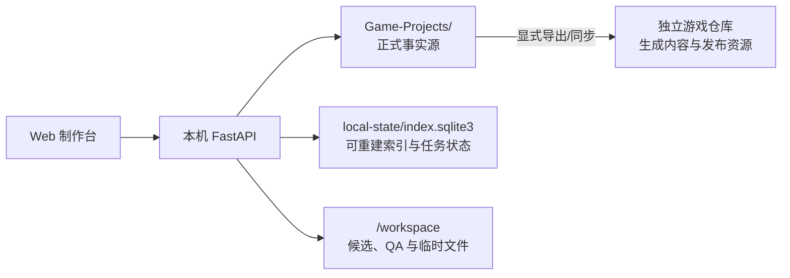
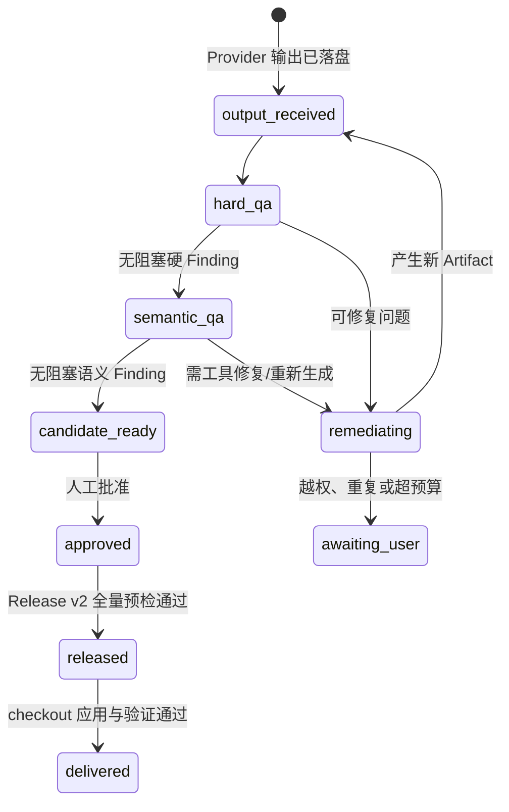
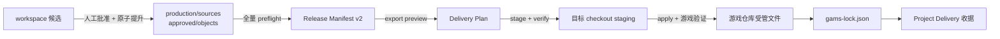

# 系统主逻辑

本文首先说明 Game Asset Management System（下文简称 GAMS）截至 2026-07-27 的当前正式运行模型。标记为“目标”的章节记录已确认但尚未实现的 v1 生产与交付契约，不得把目标状态解读为当前能力。本文不包含一次性迁移过程。

## 一句话模型

Project 文件是事实源，SQLite 是可删除重建的运行索引，API 负责把两者同步并实施校验，Web 制作台只通过固定 API 读取和修改 Project。



## 三层职责

### Project 文件层

Project 根目录必须包含 `format_version: 1` 的 `project.yaml`。正式资产描述、不可变修订、审核决定、批准媒体和 Release 都属于 Project，也是 Git 应记录的内容。

Project 内所有磁盘字段使用 `snake_case`。稳定 Key 表示业务身份，修订 ID 表示一次精确内容版本，内容哈希用于验证字节和 JSON 是否被意外改写。

### SQLite 运行层

默认数据库位于本机 `~/Library/Application Support/Game-Asset-Management-System/index.sqlite3`，不进入 iCloud，只保存：

- 从 Project 扫描得到的资产、修订、rendition、QA 和关系索引；
- 生成计划、任务、尝试次数和运行进度；
- 本机服务运行所需的关联状态。

SQLite 不是备份，也不是项目事实源。删除 `local-state` 后，正式资产和审核状态可以从 Project 文件重新索引；未完成的运行任务不会被当作正式成果恢复。

### Web 与 API 层

Web 只连接 `127.0.0.1` API。API 负责目录边界校验、原子写入、Project 锁、审核前 QA 校验以及 Release 一致性检查。供应商 API Key 不进入 Project 或 SQLite；浏览器使用 IndexedDB 保存加密密文，后端只在进程内存中持有已解锁凭据。

## 启动、发现与扫描

1. API 启动时创建 SQLite Schema。
2. 系统检查 `Game-Projects` 的直属子目录，只接受根部存在有效 `project.yaml` 的目录。
3. 启动阶段对发现的 Project 执行一次全量扫描。
4. `GET /api/projects` 每次重新同步直属 Project 列表，但不隐式重复全量扫描。
5. 工作台加载某个 Project 前调用 `POST /api/projects/{id}/scan`，然后读取资产、关系和任务。
6. 同一 Project 的扫描由进程内锁串行化，避免多个页面或刷新请求同时改写相同索引。

扫描器执行以下工作：

- 读取 `catalog/**/*.json` 中的资产描述与 `catalog/relations.json`；
- 读取 `history/objects/<prefix>/<hash>.json` 中的修订；
- 从媒体修订的 `content.rendition` 派生 SQLite rendition；
- 校验媒体路径仍在 Project 内、文件存在且 SHA-256 一致；
- 读取 QA 与审核记录并恢复当前状态；
- 在完整扫描无错误时删除 SQLite 中已经不在 Project 文件里的过期索引。

发现与扫描不会复制正式媒体，也不会创建第二套 Project 元数据。

## Catalog、修订与指针

Catalog 保存“现在有哪些资产”以及每项资产的当前状态。每项资产至少包含稳定 Key、类型、子类型、标题、标签、元数据和修订指针。

结构化内容和媒体的正文不直接重复写在 Catalog 中。创建候选时：

1. API 校验资产、Schema 和父修订关系；
2. 将规范化 JSON 计算 SHA-256；
3. 写入新的 `history/objects/<prefix>/<hash>.json`；
4. 将 Catalog 的 `latest_candidate_revision_id` 指向新修订；
5. 先前仍为 pending 的候选标记为 superseded。

历史对象按内容寻址并视为不可变。修改内容意味着创建新修订，而不是覆盖旧修订。

## 媒体预览契约

媒体修订在 `content` 内只保存一个 `rendition` 对象：

```json
{
  "rendition": {
    "media_type": "image/webp",
    "source_path": "production/sources/.../source.png",
    "normalized_path": "approved/assets/.../asset.webp",
    "target_path": "approved/assets/.../asset.webp",
    "sha256": "...",
    "width": 1024,
    "height": 1536,
    "byte_size": 275154
  }
}
```

- `source_path` 是 Project 内的制作来源；
- `normalized_path` 是用于检查和发布的归一化文件；
- `target_path` 是批准时在当前 Project 内写入的正式目标；
- 哈希、尺寸和字节数用于扫描与 QA。

SQLite rendition ID 由修订和内容哈希确定性派生。前端统一通过 `/api/renditions/{id}/content` 预览；接口再次验证实际文件属于当前 Project，不接受任意绝对路径。

## 当前生成任务

生成计划先校验任务 ID、依赖图、目标资产和输出 Schema。确认计划后，任务进入 SQLite 队列：

1. Job Runner 按依赖顺序选取可执行任务；
2. 调用已解锁供应商，记录每次尝试和可重试错误；
3. 文本结果按 Schema 校验，图片结果写入 `workspace/candidates` 并归一化；
4. 生成结果创建正式候选修订；
5. 图片运行硬 QA，报告同时写入 Project 历史与 workspace 工作区；
6. 服务重启时，运行中的任务回到 queued 或 credentials_locked，而不是伪装为完成。

当前 Job 的 `succeeded` 只表示供应商输出已处理并产生候选，不代表批准或发布。当前实现还会在硬 QA verdict 为 fail 时把 Job 标为 `succeeded`；这是 [路线图](roadmap.md) 的 P0 状态语义缺口，而不是目标行为。

## 目标生产状态机（未实现）

目标生产状态严格区分：

`output_received → hard_qa → semantic_qa → candidate_ready → approved → released → delivered`



Provider 返回只会进入 `output_received`。硬 QA、语义 QA 或预算不满足时，任务进入 remediation、`awaiting_user` 或失败；不能直接进入 `candidate_ready`。自动修复由 GAMS Controller 校验固定 `RemediationAction` 后执行，Codex 只负责诊断和提出动作。

目标计划确认必须冻结基础调用量、预计成本、网络重试和额外返工预算。同请求网络重试最多 2 次；额外调用建议值为 `max(2, ceil(基础调用量 × 20%))`，用户可以下调；单资产额外付费返工最多 2 轮。达到任一硬上限即进入 `awaiting_user`。

每个最多 6 项的依赖批次会生成联系表、参考/候选并排图、50% 叠加图、差异图、硬 QA 和结构化视觉 Finding。完整诊断与权限规则见 [Codex 监督式智能生产](agentic-production.md)。

## QA 与审核

图片 QA 检查解码、尺寸、Alpha、字节大小等硬性条件。媒体候选没有最新 QA，或最新 QA 为 fail 时，API 拒绝批准。

批准时系统会：

- 写入不可变审核决定；
- 将修订标记为 approved；
- 更新 Catalog 的 `current_revision_id`；
- 把资产状态变为 approved/ready；
- 同步当前内容产生的正式关系；
- 使依赖旧版本的已有批准决定失效，并阻止其直接发布。

驳回时审核决定同样保留；可用的候选媒体会复制到 `workspace/rejected` 便于返工，但不会成为批准资源。

## 当前 Release 与游戏仓库

当前 Release 遍历已批准资产，只把同时满足以下条件的当前修订加入 Manifest：

- 资产处于 approved；
- 存在仍有效的批准决定；
- 批准时记录的依赖哈希与当前依赖一致；
- 所有媒体 rendition 都有通过的最新硬 QA。

发布媒体时，API 从 Project 内的归一化文件原子写入 Project 内的 `target_path`。Release Manifest 记录稳定 Key、修订、内容哈希、媒体哈希和最终路径。

当前实现会跳过不满足条件的资产并继续创建部分 Release，而不是使整次 Release 失败；这属于 P0 缺口。当前批准修订也可能仍引用 `workspace/candidates`，删除 workspace 后不保证可重新发布。

`project.yaml` 中的 `export` 只声明游戏仓库内的内容、Manifest 和资源目标；当前 Release API 不会写任意外部 checkout。把 Release 同步到游戏仓库属于显式导出步骤。游戏仓库接收确定性生成内容与发布资源后，应能脱离 GAMS 独立构建和运行。

## 目标 Release → Export → Delivery（未实现）

目标链路把批准、Release 和外部交付拆成三个事务：



### 批准时提升

- 原始供应商输出提升到 Git 跟踪、内容寻址的 `production/sources`。
- 归一化运行媒体提升到 `approved/objects`。
- 正式修订只引用耐久对象，不引用 workspace。
- 审核绑定精确修订、依赖哈希和媒体 Artifact 哈希；任一步失败都不更新批准指针。

### Release v2

Release 创建前检查完整目标集合。任何批准失效、QA fail、依赖变化、路径碰撞、Blob 缺失或哈希错误都会阻止整次 Release。Manifest v2 记录稳定 Key、修订、内容哈希、媒体 Blob 哈希、目标逻辑路径和 snapshot hash，并能在删除 SQLite 后从 Project 重新索引。

### Export 与 Delivery

`project.local.yaml` 提供本机 `game_root`；`project.yaml.export` 提供提交版相对输出路径和 argv 形式的验证命令。导出依次执行 preview、stage、静态校验、apply、游戏验证和收据写入：

- 未知文件永不删除。
- 旧 `gams-lock.json` 中的受管文件若被人工修改，阻止覆盖。
- 失败时恢复上一交付；新 lock 最后写入。
- 同一 Release 重复交付且所有哈希一致时为幂等 no-op。
- 回滚通过重新导出旧 Release 完成，不修改历史 Release。
- GAMS 不执行 Git 操作；验证后只展示 Project 与游戏仓库 diff。

完整 Manifest、lock、Emperor-Simulator 路径和验收命令见 [Release 与游戏项目交付](release-delivery.md)。

## Git 与本机状态边界

GAMS 不执行 `git add`、commit、push 或历史改写。`Game-Projects` 是唯一父 Git 仓库，Project 不建立嵌套仓库。PNG 和 WebP 作为普通 Git 文件保存。

| 位置 | 性质 | 是否提交 |
|---|---|---|
| `Game-Projects/<Project>/catalog`、`history`、`production`、`approved`、`releases` | 正式事实 | 是 |
| `Game-Projects/<Project>/workspace` | 候选、QA、缓存、日志 | 否 |
| `Game-Projects/<Project>/project.local.yaml` | 本机游戏仓库绑定 | 否 |
| `~/Library/Application Support/Game-Asset-Management-System` | SQLite 与运行索引 | 否（仅本机） |
| 浏览器 IndexedDB | 加密供应商配置 | 否 |

## 故障判断

- Project 不出现在列表：检查它是否是 `Game-Projects` 的直属目录，以及 `project.yaml` 是否为有效格式。
- 资产数量不对：先调用 Project 扫描并查看返回的 `errors`，不要手工改 SQLite。
- 图片无预览：检查当前媒体修订是否含完整 `content.rendition`，再检查路径、哈希和 MIME。
- 批准按钮不可用：检查候选修订和最新硬 QA，而不是直接修改状态字段。
- SQLite 损坏：停止服务，移走 `local-state` 后重启扫描；正式 Project 文件不应受影响。
