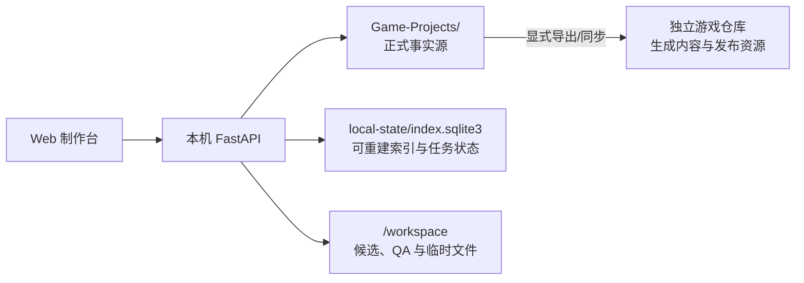
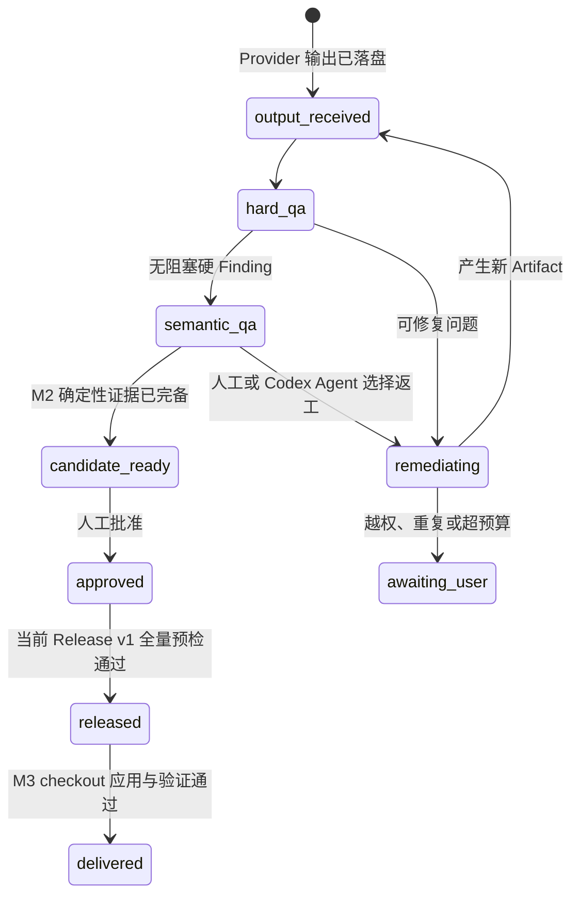
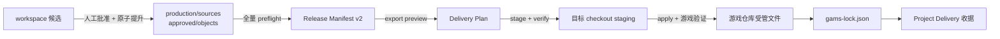

# 系统主逻辑

本文首先说明 Game Asset Management System（下文简称 GAMS）截至 2026-08-05 的当前正式运行模型。标记为“目标”的章节记录 M8 及以后尚未实现的生产能力，不得把目标状态解读为当前能力。本文把 M5 旧媒体升级作为显式、可审计的一次性迁移操作，不把它混入普通扫描过程。

## 一句话模型

Project 文件是事实源，SQLite 是可删除重建的运行索引，API 负责把两者同步并实施校验，Web 制作台只通过固定 API 读取和修改 Project。



## 三层职责

### Project 文件层

Project 根目录必须包含 `format_version: 1` 的 `project.yaml`。正式资产描述、不可变修订、审核决定、批准媒体和 Release 都属于 Project，也是 Git 应记录的内容。

Project 内所有磁盘字段使用 `snake_case`。稳定 Key 表示业务身份，修订 ID 表示一次精确内容版本，内容哈希用于验证字节和 JSON 是否被意外改写。

### SQLite 运行层

默认数据库位于本机 `~/Library/Application Support/Game-Asset-Management-System/index.sqlite3`，不进入 iCloud，只保存：

- 从 Project 扫描得到的资产、修订、rendition、QA 和关系索引；
- 从 Project 扫描得到的 Artifact、审核决定和 Release 索引；
- 生成计划、任务、尝试次数和运行进度；
- Job lease、heartbeat、Finding、Evidence、RemediationAction、调用预算和持久运行事件；
- 多供应商配置、模型缓存、全局默认路由和已确认 Job 的供应商运行快照；
- 本机服务运行所需的关联状态。

SQLite 不是备份，也不是项目事实源。删除 `local-state` 后，正式资产和审核状态可以从 Project 文件重新索引；供应商本机设置、模型缓存和未完成运行会丢失，也不会被当作正式成果恢复。

### Web 与 API 层

Web 只连接 `127.0.0.1` API。API 负责目录边界校验、原子写入、Project 锁、审核前 QA 校验以及 Release 一致性检查。供应商 API Key 不进入 Project 或 SQLite；浏览器按供应商 ID 使用 IndexedDB 保存加密密文，后端只在进程内存中持有已解锁凭据。Web 连上本地服务后逐个解锁所有活动供应商，单个凭据失败不会影响其他配置。

## 启动、发现与扫描

1. API 启动时创建 SQLite Schema。
2. 系统检查 `Game-Projects` 的直属子目录，只接受根部存在有效 `project.yaml` 的目录。
3. 启动阶段对发现的 Project 执行一次全量扫描。
4. `GET /api/projects` 每次重新同步直属 Project 列表，但不隐式重复全量扫描。
5. 工作台加载某个 Project 前调用 `POST /api/projects/{id}/scan`，然后读取资产、关系和任务。
6. 同一 Project 的扫描由进程内锁串行化，避免多个页面或刷新请求同时改写相同索引。

扫描器执行以下工作：

- 读取 `catalog/**/*.json` 中的资产描述与 `catalog/relations.json`；
- 读取 `history/objects/<prefix>/<hash>.json` 中的修订；
- 区分并验证同一对象库中的 Artifact 元数据，复核 `production/sources` 与 `approved/objects` Blob 哈希；
- 从媒体修订的 `content.rendition` 派生 SQLite rendition；
- 校验媒体路径仍在 Project 内、文件存在且 SHA-256 一致；
- 读取 QA 与真实审核记录，按最新决定和当前依赖哈希恢复有效性，不从 Catalog 指针推测审核；
- 读取 `releases/*/manifest.json` 并恢复 Release 索引；
- 在完整扫描无错误时删除 SQLite 中已经不在 Project 文件里的过期索引。

发现与扫描不会复制正式媒体，也不会创建第二套 Project 元数据。

## Catalog、修订与指针

Catalog 保存“现在有哪些资产”以及每项资产的当前状态。每项资产至少包含稳定 Key、类型、子类型、标题、标签、元数据和修订指针。

结构化内容和媒体的正文不直接重复写在 Catalog 中。创建候选时：

1. API 校验资产、Schema 和父修订关系；
2. 将规范化 JSON 计算 SHA-256；
3. 写入新的 `history/objects/<prefix>/<hash>.json`；
4. 将 Catalog 的 `latest_candidate_revision_id` 指向新修订；
5. 先前仍为 pending 的候选标记为 superseded。

历史对象按内容寻址并视为不可变。修改内容意味着创建新修订，而不是覆盖旧修订。

## 媒体预览契约

媒体修订在 `content` 内只保存一个 `rendition` 对象：

```json
{
  "rendition": {
    "media_type": "image/webp",
    "source_path": "production/sources/ab/ab....png",
    "source_sha256": "...",
    "source_artifact_id": "artifact_...",
    "normalized_path": "approved/objects/cd/cd....webp",
    "artifact_id": "artifact_...",
    "target_path": "public/assets/.../asset.webp",
    "sha256": "...",
    "width": 1024,
    "height": 1536,
    "byte_size": 275154
  }
}
```

- `source_path` 是 Project 内内容寻址的耐久制作来源；
- `normalized_path` 是用于检查和 Release 的内容寻址批准对象；
- `source_artifact_id` 与 `artifact_id` 绑定不可变 Artifact 元数据、父子关系和工具版本；
- `target_path` 是后续 Delivery 使用的逻辑目标，Release 不直接写该位置；
- 哈希、尺寸和字节数用于扫描与 QA。

SQLite rendition ID 由修订和内容哈希确定性派生。前端统一通过 `/api/renditions/{id}/content` 预览；接口再次验证实际文件属于当前 Project，不接受任意绝对路径。

## 多供应商与任务级模型路由

系统可以同时保存多个 OpenAI 兼容供应商。每个配置独立记录 Base URL、默认文字模型、默认图片模型、质量、并发、网络重试、模态价格、活动状态、模型缓存和最近刷新时间；归档只阻止新计划分配，不删除历史。

模型目录按供应商缓存。保存或解锁后，缺失或超过 24 小时的缓存会自动刷新，也可手动调用刷新 API。刷新优先读取供应商模态元数据，否则使用确定性模型名称规则建议文字/图片分类；用户可以覆盖分类或直接输入模型 ID。刷新失败保留旧缓存，下次成功刷新会把未再出现的模型标记为不可用而不是删除。

全局只保存一组文字与图片默认路由：

- 新文字任务继承文字供应商和模型；
- 新图片生成与图片编辑任务继承图片供应商和模型；
- 切换任务供应商时改用该供应商对应模态的默认模型；
- 切换任务类型时重新读取该类型的全局默认；
- 已建立草稿和已确认计划不随默认配置变化。

任务必须有活动供应商和非空模型。模型被明确分类为不兼容时阻止确认；未分类、手填或最近已下线的模型允许确认但显示警告。预算复核逐任务展示供应商与模型，并按供应商级模态价格汇总；任何任务价格未知时，总价明确标记未知。

确认时 Controller 为每个 Job 冻结供应商配置和显式模型，不把 API Key 写入快照。Runner 不读取后来修改的 Base URL、默认模型、质量、并发或价格，也不自动换模型或切换供应商。凭据锁定的 Job 保持 `credentials_locked`，使用其他已解锁供应商的无依赖 Job 仍可运行；跨供应商下游会等待锁定上游。模型下线或请求被供应商拒绝时写入 `provider.model_unavailable` 并进入 `awaiting_user`，用户必须创建重做任务或新计划并重新确认预算。

## 当前生成任务

Web 计划编辑器先校验任务 ID、依赖图、目标资产、输出 Schema、尺寸、参考任务和预算。用户查看基础调用量、预计成本、额外调用额度、单资产付费轮次、网络重试和并发后显式确认，任务才进入 SQLite 队列：

1. Controller 以原子 claim 和 lease 取得所有依赖已就绪的 Job；计划总并发限制整个计划，每个供应商的冻结并发限制该供应商任务，两个计数同时生效，heartbeat 在长调用期间续租。
2. DAG 下游请求注入上游任务的 Job/修订 ID、内容哈希和结构化产物；图像编辑从明确的上游或当前候选解析参考图。
3. 每个实际 Runner 调用显式传入冻结模型，创建持久 Attempt、稳定请求哈希和幂等 Key，并更新计划实际调用量与冻结价格成本。Attempt、事件、Revision 供应商快照和运行检查器都记录实际供应商与模型；网络、鉴权、额度、内容策略、模型不可用和未知错误分类处理。
4. Provider 输出先以哈希落入 `workspace/candidates`，Job 进入 `output_received`；文本按 Schema 校验，图片归一化并创建候选修订与 rendition。
5. 图片执行硬 QA，生成稳定 code 的 Finding、当前候选、三种联系表，以及可用时的并排、50% 叠加和差异证据。
6. 硬 QA fail 进入 `awaiting_user`，不会成为候选就绪。人工运行检查器可选择注册 Worker、同请求重试、重新生成、图像编辑或继续等待；Controller 再校验状态、输入哈希、预算与策略。
7. 服务重启或 lease 过期时，只自动恢复尚未 dispatch 的任务、已知可重试失败、哈希匹配的 `output_received`/`staged` 输出或确定性 Worker。dispatch 后交付未知的调用进入 `awaiting_user`，不重复调用。

`GenerationAttempt.status = succeeded` 只表示供应商或 Worker 已产生可记录输出；Job 的 `candidate_ready` 表示确定性自动检查通过并可供人工审核，不代表已经人工批准、Release 或 Delivery。

## 当前生产状态机

生产状态严格区分：

`output_received → hard_qa → semantic_qa → candidate_ready → approved → released → delivered`



Provider 返回只会进入 `output_received`。硬 QA 或预算不满足时，任务进入 remediation、`awaiting_user` 或失败；不能直接进入 `candidate_ready`。M2 的 `semantic_qa` 生成结构化证据并等待可审查边界，M4 可请求隔离 Codex Agent 生成语义 Finding 与策略建议；人工动作和 Codex 动作都必须由 GAMS Controller 校验后执行。

计划确认冻结每项任务的供应商、模型、运行配置、基础调用量、预计成本、网络重试和额外返工预算。同请求网络重试默认最多 2 次；额外调用建议值为 `max(2, ceil(基础调用量 × 20%))`，用户可以下调；单资产额外付费返工默认最多 2 轮。达到任一硬上限即进入 `awaiting_user`。

每个最多 6 项的依赖批次会生成联系表；有参考输入时同时生成参考/候选并排图、50% 叠加图和差异图，没有参考时持久记录不适用原因。完整诊断与权限规则见 [Codex 监督式智能生产](agentic-production.md)。

## QA 与审核

图片 QA 检查解码、尺寸、Alpha、字节大小等硬性条件。媒体候选没有最新 QA，或最新 QA 为 fail 时，API 拒绝批准。

批准媒体时系统会：

- 把原始输出和归一化媒体分别提升为来源 Artifact 与运行 Artifact；
- 创建只引用耐久 Artifact 的 promotion 修订并重新执行硬 QA；
- 写入绑定准确修订、依赖哈希和两个 Artifact 哈希的不可变审核决定；
- 最后更新 Catalog 的 `current_revision_id`；
- 把资产状态变为 approved/ready；
- 同步当前内容产生的正式关系；
- 使依赖旧版本的已有批准决定失效，并阻止其直接发布。

驳回时审核决定同样保留；可用的候选媒体会复制到 `workspace/rejected` 便于返工，但不会成为批准资源。

## 当前 Release 与游戏仓库

当前 Release 对全部已批准资产执行一次预检，要求：

- 资产处于 approved；
- 存在仍有效的批准决定；
- 批准时记录的依赖哈希与当前依赖一致；
- 所有媒体 rendition 都有通过的最新硬 QA；
- 正式媒体不引用 workspace，耐久 Blob 存在且哈希/体积一致；
- 新 promotion 修订的 Artifact 与审核绑定一致；
- 所有逻辑目标路径合法且没有大小写碰撞。

只要存在一个阻塞问题，Release 就返回完整预检错误，不写 Manifest、不改变 `publication_status`。成功时以一个文件事务写入不可变 Manifest、当前 Release 指针和 Catalog 发布状态；写入中途失败会恢复原状态。

Release Manifest v1 记录稳定 Key、修订、内容哈希、依赖哈希、Artifact、媒体哈希、耐久 Project 路径和逻辑 `target_path`。Release 不向外部 checkout 或逻辑目标复制媒体；这一动作属于 M3 Delivery。

`project.yaml` 中的 `export` 只声明游戏仓库内的内容、Manifest 和资源目标；当前 Release API 不会写任意外部 checkout。把 Release 同步到游戏仓库属于显式导出步骤。游戏仓库接收确定性生成内容与发布资源后，应能脱离 GAMS 独立构建和运行。

## Release → Export → Delivery 事务

当前链路把批准、Release 和外部交付拆成三个事务：



### 批准时提升

- 原始供应商输出提升到 Git 跟踪、内容寻址的 `production/sources`。
- 归一化运行媒体提升到 `approved/objects`。
- 正式修订只引用耐久对象，不引用 workspace。
- 审核绑定精确修订、依赖哈希和媒体 Artifact 哈希；任一步失败都不更新批准指针。

### Release v2

Release 创建前检查完整目标集合。任何批准失效、QA fail、依赖变化、路径碰撞、Blob 缺失或哈希错误都会阻止整次 Release。Manifest v2 记录稳定 Key、修订、内容哈希、媒体 Blob 哈希、目标逻辑路径和 snapshot hash，并能在删除 SQLite 后从 Project 重新索引。

### Export 与 Delivery

`project.local.yaml` 提供本机 `game_root`；`project.yaml.export` 提供提交版相对输出路径和 argv 形式的验证命令。导出依次执行 preview、stage、静态校验、apply、游戏验证和收据写入：

- 未知文件永不删除。
- 旧 `gams-lock.json` 中的受管文件若被人工修改，阻止覆盖。
- 失败时恢复上一交付；新 lock 最后写入。
- 同一 Release 重复交付且所有哈希一致时为幂等 no-op。
- 回滚通过重新导出旧 Release 完成，不修改历史 Release。
- GAMS 不执行 Git 操作；验证后只展示 Project 与游戏仓库 diff。

完整 Manifest、lock、Emperor-Simulator 路径和验收命令见 [Release 与游戏项目交付](release-delivery.md)；M5 replay、旧媒体升级和已知游戏侧验收阻塞见 [M5 Emperor-Simulator 试点](m5-pilot.md)；M6 发布门禁、恢复演练和格式升级见 [M6 v1 发布验收](m6-release.md)。

## Git 与本机状态边界

GAMS 不执行 `git add`、commit、push 或历史改写。`Game-Projects` 是唯一父 Git 仓库，Project 不建立嵌套仓库。PNG 和 WebP 作为普通 Git 文件保存。

| 位置 | 性质 | 是否提交 |
|---|---|---|
| `Game-Projects/<Project>/catalog`、`history`、`production`、`approved`、`releases` | 正式事实 | 是 |
| `Game-Projects/<Project>/workspace` | 候选、QA、缓存、日志 | 否 |
| `Game-Projects/<Project>/project.local.yaml` | 本机游戏仓库绑定 | 否 |
| `~/Library/Application Support/Game-Asset-Management-System` | SQLite 与运行索引 | 否（仅本机） |
| 浏览器 IndexedDB | 按供应商隔离的加密 API Key | 否 |

## 故障判断

- Project 不出现在列表：检查它是否是 `Game-Projects` 的直属目录，以及 `project.yaml` 是否为有效格式。
- 资产数量不对：先调用 Project 扫描并查看返回的 `errors`，不要手工改 SQLite。
- 图片无预览：检查当前媒体修订是否含完整 `content.rendition`，再检查路径、哈希和 MIME。
- 批准按钮不可用：检查候选修订和最新硬 QA，而不是直接修改状态字段。
- 新任务无法确认：检查文字/图片默认路由、任务供应商、模型 ID 和模型模态分类；凭据锁定本身不会改写路由。
- 模型不可用：在运行检查器确认冻结供应商与模型，创建重做任务或新计划重新选路由；不要期待自动回退。
- SQLite 损坏：停止服务，移走 `local-state` 后重启扫描；正式 Project 文件不应受影响。
